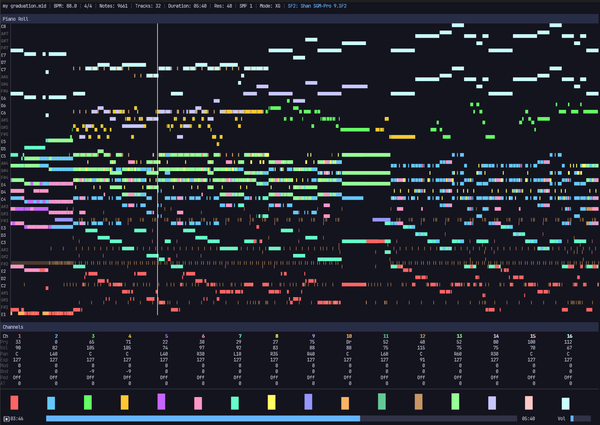

# ump

A native GUI MIDI player with SF2 soundfont synthesis.

Built with Rust, using hardware-accelerated rendering (Direct2D or wgpu) and a custom sequencer for low-latency audio playback.



## Features

- **SF2 Soundfont Synthesis** -- Real-time MIDI rendering via a [rustysynth](https://github.com/sinshu/rustysynth) fork with cubic interpolation, FDN reverb, multi-voice chorus, SVF filter, and SF2 modulator support
- **Multi-SF2 Bundles** -- Load multiple SF2 files with per-channel routing; configure mode-specific bundles (GM/GS/XG/GM2) that auto-switch on detection
- **Piano Roll** -- Scrolling note visualization with per-channel coloring; horizontal (default) and vertical (step-sequencer style) modes
- **Track List** -- Two view modes: Default (16-channel grid with bank/reverb/chorus state) and Detail (per-track tree)
- **MIDI Mode Detection** -- Auto-detects GM/GS/XG/GM2 from SysEx reset messages and bank select patterns; manual override with `1`-`4` keys
- **Per-Track Mute** -- Mute/unmute individual channels during playback
- **Seek** -- Forward/backward seeking with full state reconstruction (program changes, control changes, pitch bends)
- **Custom Fonts** -- Load `.ttf`/`.otf`/`.ttc` font files via settings
- **File Browser** -- Built-in file browser for selecting MIDI and SF2 files; drive root navigation with `/` or `\`
- **Settings Persistence** -- Window geometry, volume, display mode, font, and soundfont paths saved to `settings.toml`
- **Volume Control** -- Application volume (`+`/`-`) multiplied with MIDI master volume (SysEx)

### Keybindings

| Key | Action |
|---|---|
| `Space` | Play / Pause |
| `S` | Stop |
| `Left` / `Right` | Seek -5s / +5s |
| `Up` / `Down` | Cursor Up / Down |
| `M` | Mute / Unmute track |
| `P` | Toggle piano roll |
| `V` | Toggle piano roll orientation |
| `E` | Toggle track view (Detail) |
| `+` / `-` | Volume Up / Down |
| `[` / `]` | Zoom Out / In |
| `Tab` | Cycle focus panel |
| `O` | Open MIDI file |
| `F` | Open SF2 file |
| `D` | Reset SF2 to default |
| `1`-`4` | Set mode (GM / GS / XG / GM2) |
| `?` | Toggle help overlay |
| `Q` / `Esc` | Quit |

## Build

### Rendering Backend

Two rendering backends are available, selected at compile time via Cargo feature flags:

| Feature | Backend | Platform | Default |
|---|---|---|---|
| `d2d` | Direct2D / DirectWrite | Windows only | Yes (Windows) |
| `wgpu-backend` | wgpu + glyphon | Cross-platform | -- |

```sh
# Windows (D2D, default)
cargo build --release

# Windows (wgpu)
cargo build --release --no-default-features --features wgpu-backend

# Linux / macOS (wgpu)
cargo build --release --no-default-features --features wgpu-backend
```

> **Note:** Cargo does not support platform-conditional default features. On non-Windows platforms, you must explicitly specify `--no-default-features --features wgpu-backend`.

### Requirements

- Rust 1.70+ (edition 2021)
- **D2D backend:** Windows 10 or later
- **wgpu backend:** Vulkan, Metal, or DX12 capable GPU

### Usage

```sh
# Launch with file browser
ump

# Open a MIDI file directly
ump path/to/file.mid

# Specify a soundfont
ump path/to/file.mid --sf2 path/to/soundfont.sf2
```

## Configuration

Settings are stored at the platform config directory. See [settings.example.toml](settings.example.toml) for all available options.

| Platform | Path |
|---|---|
| Windows | `%APPDATA%/ump/settings.toml` |
| Linux | `~/.config/ump/settings.toml` |
| macOS | `~/Library/Application Support/ump/settings.toml` |

Relative paths in `settings.toml` are resolved against the config directory.

### Multi-SF2 Bundles

You can configure per-mode soundfont bundles with channel routing in `settings.toml`:

```toml
[soundfont.bundles.GS]
files = ["gs.sf2", "gs_drums.sf2"]
routing = [0, 0, 0, 0, 0, 0, 0, 0, 0, 1, 0, 0, 0, 0, 0, 0]
```

- `files`: list of SF2 file paths (relative to config directory or absolute)
- `routing`: channel 0-15 mapped to file index (default: all channels use file 0)

When a MIDI mode is detected or manually selected, the matching bundle is loaded automatically. If no bundle is configured for a mode, the current single SF2 is used.

## Limitations

- **Linux/macOS support is experimental** -- The wgpu backend is functional but less tested than the D2D backend on Windows.
- **SysEx support is partial** -- GM/GS/XG/GM2 reset, Master Volume, master tune, scale tuning, and GS drum map changes are processed. Other SysEx commands (e.g. GS part parameters, XG effect settings) are parsed but not fully reproduced.
- **SF2 modulators are partial** -- SF2 Default Modulators (Phase 1) are implemented. Custom per-preset modulators from `pmod`/`imod` chunks are not yet parsed.
- **No MIDI output** -- Playback is software-synthesized only. External MIDI device output is not supported.
- **No audio device selection** -- Uses the system default audio output device.

## Dependencies

| Crate | Purpose |
|---|---|
| [midly](https://crates.io/crates/midly) | MIDI file parsing |
| [rustysynth](https://github.com/yuiAs/rustysynth) | SF2 soundfont synthesizer (fork with SysEx, mute, effect control, cubic interpolation, FDN reverb, SVF filter, and more) |
| [cpal](https://crates.io/crates/cpal) | Cross-platform audio output |
| [winit](https://crates.io/crates/winit) | Window creation and event loop |
| [windows](https://crates.io/crates/windows) | Direct2D / DirectWrite rendering (d2d feature) |
| [wgpu](https://crates.io/crates/wgpu) | Cross-platform GPU rendering (wgpu-backend feature) |
| [glyphon](https://crates.io/crates/glyphon) | Text rendering for wgpu (wgpu-backend feature) |
| [clap](https://crates.io/crates/clap) | Command-line argument parsing |
| [anyhow](https://crates.io/crates/anyhow) | Error handling |
| [serde](https://crates.io/crates/serde) / [toml](https://crates.io/crates/toml) | Settings serialization |
| [dirs](https://crates.io/crates/dirs) | Platform config directory resolution |

## License

[MIT](LICENSE)
